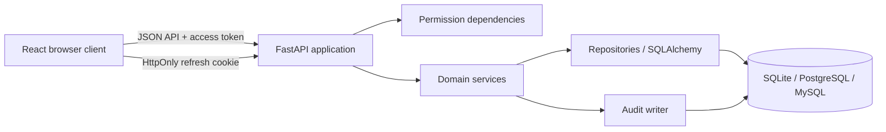

# Architecture and authorization

SkillHive is a browser client and REST API backed by a relational database. The design favors
explicit service-layer authorization, immutable content versions, and portable SQL types.

## Backend request path

API routers validate HTTP input with Pydantic schemas and resolve authenticated principals.
Permission dependencies reject global role violations early. Domain services enforce
resource-specific ownership and group-role rules, coordinate repositories, create version/audit
records, and return typed results.

Repositories centralize SQLAlchemy queries. A UI permission check is never sufficient: every
read/write path must include its backend authorization condition.

## Content boundaries

### Private content

Private skills, their versions, and personal templates are owner-scoped. Queries include the
owner identity; being a platform administrator does not remove that predicate. Operators with
direct database/backup access remain outside this application boundary.

### Group content

Membership has `owner`, `admin`, or `member` role. Owners control administrators, ownership
transfer, and dissolution. Administrators manage ordinary members and group-scoped resources.
Members consume allowed resources and may invite only when the group setting permits.

### Platform content

Platform administrators govern account/group status, global templates, global skills and
versions, group grants, and audit records. A global skill must be published and granted before a
group manager can enable it.

## Version model

A private or global skill points to its current version, while each content revision is retained
as an immutable version row. Group grants can follow the latest eligible published version or lock
to one version. Templates generate new private skill records; generated skills do not maintain a
live content link back to the template.

## Authentication

Passwords use Argon2 through `pwdlib`. JWT access tokens are short-lived. Refresh tokens are
represented by revocable, rotating database sessions and delivered through HttpOnly cookies.
Changing a password revokes refresh sessions.

Login-failure tracking is keyed by client address and identity in process memory. It is adequate
as a local safeguard, not a shared distributed limiter.

## Database portability

Domain models use portable strings, booleans, timestamps, text, and JSON. Enumerated values are
validated by the application. SQLite is the local default; PostgreSQL and MySQL use their
respective SQLAlchemy drivers. Alembic owns schema evolution.

## Frontend state

TanStack Query owns server-state caching and invalidation. Zustand holds authentication state and
device-local theme preference. The access token remains in memory; refresh-cookie credentials
allow session restoration. Route visibility improves usability but does not replace API checks.

## Audit behavior

Authentication, account, group, skill, template, version, publication, and grant actions can
produce audit records. Audit writing belongs with the domain transaction wherever practical so a
successful sensitive mutation is traceable.

## Extension rules

When adding a resource:

1. define its owner or audience boundary;
2. add schema validation and service-layer authorization;
3. ensure every repository query carries the boundary;
4. add allow/deny/isolation tests;
5. decide versioning and audit behavior;
6. migrate the schema with a new Alembic revision;
7. update OpenAPI-facing and bilingual user documentation.